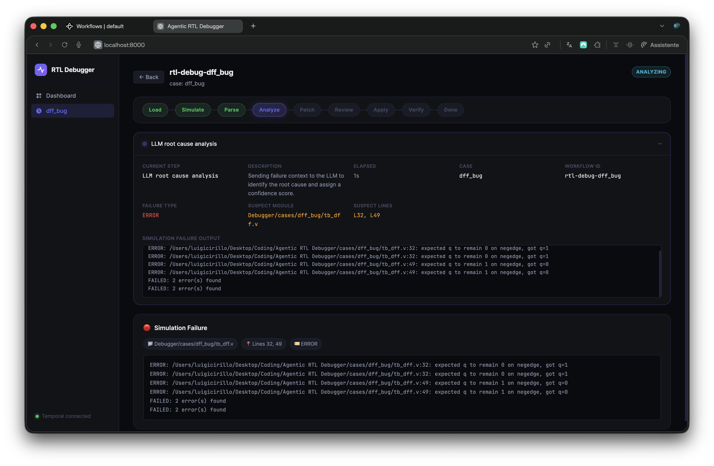
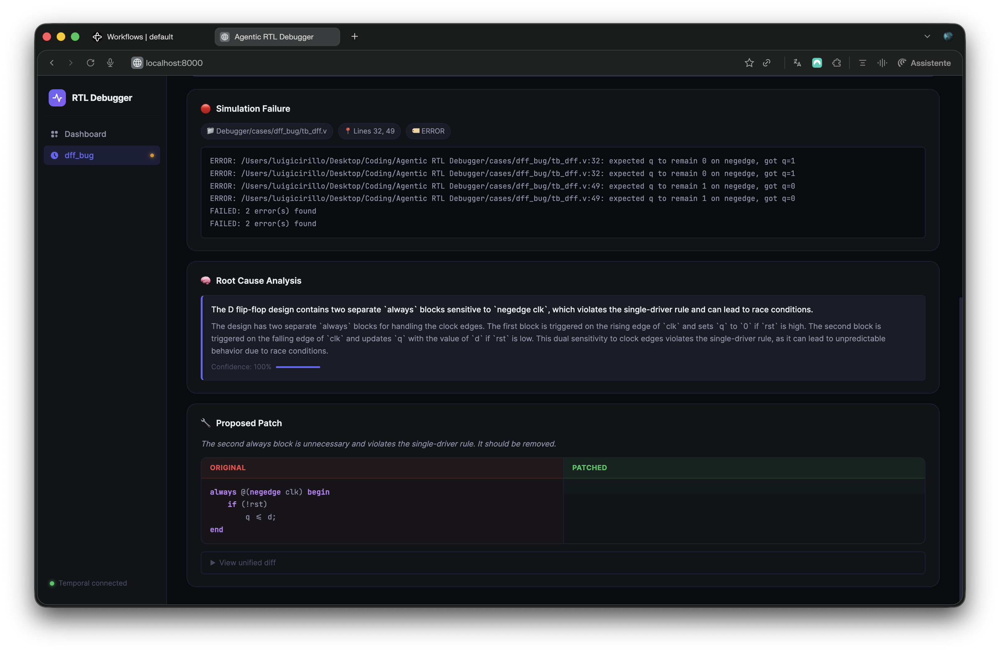

# Agentic RTL Debugger

> An agentic AI workflow for hardware verification — built to explore **Temporal durable workflows**, **LLM-powered debugging agents**, and **local Ollama models**.

---

## What is this?

The **Agentic RTL Debugger** orchestrates a realistic chip-verification debug cycle as a fully durable, resumable Temporal workflow. Given a Verilog RTL design that fails simulation, the system:

1. Compiles and simulates the design with **Icarus Verilog**
2. Parses the failure log and extracts a focused RTL context window
3. Asks a **local LLM (Ollama)** for a structured root cause analysis
4. Asks the LLM for a minimal code patch
5. Pauses and waits for **human approval** via a Temporal Signal
6. Applies the approved patch, reruns simulation, and saves the full debug report

The whole pipeline is backed by **Temporal.io**, which makes every step durable — the workflow can survive crashes, worker restarts, or hours of waiting for a human reviewer without losing state.

> **Why this project?**
> It was built as a hands-on experiment to try three things together: **Temporal workflows** for durable orchestration, **AI agents** running multi-step reasoning tasks, and **local Ollama models** as the LLM backend — no cloud API required by default.

> **Note on the web interface:**
> The browser UI (`web/`) was entirely **vibe-coded** (AI-assisted rapid prototyping) since the frontend is not the focus of the project. It exists purely to make the demo approachable. All the interesting engineering is in the Temporal workflow layer.

---

## Showcase

> _Screenshots and screen-recordings will be added here._

### Dashboard — case selection


### Live pipeline view



### Human approval gate



### Debug report


---

## Architecture overview

```
┌──────────────┐      HTTP / SSE      ┌───────────────────────┐
│   Browser    │ ◄──────────────────► │  FastAPI  (run_api.py) │
│   (web/)     │                      │  app/api/             │
└──────────────┘                      └──────────┬────────────┘
                                                 │ Temporal SDK
                                                 ▼
                                      ┌──────────────────────┐
                                      │   Temporal Server    │
                                      │   (localhost:7233)   │
                                      └──────────┬───────────┘
                                                 │
                                      ┌──────────▼───────────┐
                                      │  Temporal Worker     │
                                      │  (run_worker.py)     │
                                      │                      │
                                      │  RTLDebugWorkflow    │
                                      │  ├─ load_case_files  │
                                      │  ├─ run_compile      │
                                      │  ├─ run_simulation   │
                                      │  ├─ parse_log        │
                                      │  ├─ build_context    │
                                      │  ├─ generate_rca     │
                                      │  ├─ generate_patch   │
                                      │  ├─ [approval gate]  │
                                      │  ├─ apply_patch      │
                                      │  ├─ rerun_simulation │
                                      │  └─ save_report      │
                                      └──────────┬───────────┘
                                                 │
                                      ┌──────────▼───────────┐
                                      │   Ollama / OpenAI /  │
                                      │   Anthropic  (LLM)   │
                                      └──────────────────────┘
```

See [`docs/architecture.md`](docs/architecture.md) for the detailed Temporal workflow architecture and [`docs/web-architecture.md`](docs/web-architecture.md) for the web / API layer.

---

## Tech stack

| Component | Technology |
|---|---|
| Durable orchestration | [Temporal.io](https://temporal.io) (Python SDK ≥ 1.7) |
| LLM backend (default) | [Ollama](https://ollama.com) — local models, no cloud key needed |
| LLM alternatives | OpenAI API, Anthropic API |
| Default model | `qwen2.5-coder:7b` (recommended for RTL reasoning) |
| RTL simulation | [Icarus Verilog](https://steveicarus.github.io/iverilog/) (`iverilog` + `vvp`) |
| API server | [FastAPI](https://fastapi.tiangolo.com) + Uvicorn |
| Data models | [Pydantic v2](https://docs.pydantic.dev) |
| Web UI | Vanilla HTML / CSS / JS (vibe-coded) |

---

## Prerequisites

- Python 3.11+
- [Temporal CLI](https://docs.temporal.io/cli) or a running Temporal server (`localhost:7233`)
- [Icarus Verilog](https://steveicarus.github.io/iverilog/) (`iverilog` and `vvp` on PATH)
- **One of the following LLM backends:**
  - **Ollama** (recommended): `brew install ollama` then `ollama pull qwen2.5-coder:7b`
  - OpenAI API key
  - Anthropic API key

---

## Setup

1. **Clone the repository**:
   ```bash
   git clone https://github.com/GGCIRILLO/Agentic-RTL-Debugger.git
   cd Agentic-RTL-Debugger
   ```

2. **Create and activate a virtual environment**:
   ```bash
   python3 -m venv venv
   source venv/bin/activate        # macOS / Linux
   # .\venv\Scripts\activate       # Windows
   ```

3. **Install dependencies**:
   ```bash
   pip install -r requirements.txt
   ```

4. **Configure environment variables**:
   ```bash
   cp .env.example .env
   # Edit .env — set LLM_PROVIDER, LLM_MODEL, and any required API keys
   ```

5. **Start the Temporal development server** (separate terminal):
   ```bash
   temporal server start-dev
   ```

6. *(Ollama only)* **Start Ollama and pull the model**:
   ```bash
   ollama serve               # in a separate terminal
   ollama pull qwen2.5-coder:7b
   ```

---

## How to run

All four processes must be running simultaneously. Open four terminals.

### Terminal 1 — Temporal server
```bash
temporal server start-dev
```

### Terminal 2 — Temporal Worker
```bash
source venv/bin/activate
python run_worker.py
```

### Terminal 3 — FastAPI server (web UI + API)
```bash
source venv/bin/activate
python run_api.py
# or: uvicorn app.api.main:app --reload --port 8000
```
Open **http://localhost:8000** in your browser to use the web UI.

### Terminal 4 — Start a workflow (CLI or web UI)

**Via the web UI**: click a case card on the Dashboard, then watch the pipeline.

**Via CLI**:
```bash
# Start a workflow
python run_starter.py counter_bug

# Send the human-approval signal (after the LLM proposes a patch)
python run_signal.py rtl-debug-counter_bug approve
```

---

## Available bug cases

| Case | Description |
|---|---|
| `counter_bug` | 4-bit synchronous counter — missing `else` branch in reset logic |
| `alu_bug` | Simple ALU — incorrect operation encoding |
| `dff_bug` | D flip-flop — wrong clock-edge sensitivity |
| `mux_bug` | 4-to-1 multiplexer — off-by-one in select logic |
| `fifo_bug` | Synchronous FIFO — pointer wrap-around defect |

Each case lives under `cases/<case_id>/` and contains:
- `<module>.v` — intentionally buggy RTL source
- `tb_<module>.v` — testbench that exposes the bug
- `spec.md` — human-readable specification

---

## LLM configuration

Edit `.env` to switch providers:

```env
# Ollama (local — no API key required)
LLM_PROVIDER=ollama
LLM_MODEL=qwen2.5-coder:7b
OLLAMA_BASE_URL=http://localhost:11434/v1

# OpenAI
# LLM_PROVIDER=openai
# LLM_MODEL=gpt-4o
# OPENAI_API_KEY=sk-...

# Anthropic
# LLM_PROVIDER=anthropic
# LLM_MODEL=claude-3-5-sonnet-20241022
# ANTHROPIC_API_KEY=sk-ant-...
```

---

## Output artefacts

All runtime output is written to `outputs/` (excluded from version control):

```
outputs/
├── logs/
│   ├── <case_id>_compile.log
│   ├── <case_id>_simulation.log
│   ├── <case_id>_patch_compile.log
│   └── <case_id>_patch_simulation.log
├── patched/
│   └── <case_id>/<rtl_filename>
└── reports/
    ├── <case_id>_report.json
    └── <case_id>_report.md
```

---

## Project structure

```
Agentic-RTL-Debugger/
├── app/
│   ├── workflows.py        # Temporal workflow (pure orchestration, no I/O)
│   ├── activities.py       # All side effects: filesystem, subprocess, LLM
│   ├── models.py           # Pydantic data models
│   ├── llm_client.py       # Async LLM wrapper (Ollama / OpenAI / Anthropic)
│   ├── prompts.py          # Prompt templates
│   ├── log_parser.py       # Regex-based failure extractor
│   ├── context_builder.py  # RTL context window builder
│   ├── patcher.py          # Safe patch application
│   ├── config.py           # Env-based configuration
│   └── api/
│       ├── main.py         # FastAPI app + Temporal client lifecycle
│       └── routers/
│           ├── workflows.py  # Workflow start / status / signal / SSE routes
│           └── cases.py      # Case listing and source file routes
├── tools/
│   ├── simulation.py       # Async iverilog + vvp subprocess wrapper
│   ├── file_reader.py      # Case file loader
│   └── diff_utils.py       # Unified diff generation
├── cases/
│   ├── counter_bug/
│   ├── alu_bug/
│   ├── dff_bug/
│   ├── mux_bug/
│   └── fifo_bug/
├── web/
│   ├── index.html          # Single-page web UI (vibe-coded)
│   └── assets/             # CSS and JS
├── docs/
│   ├── architecture.md         # Temporal workflow architecture (detailed)
│   ├── web-architecture.md     # Web / API architecture
│   └── roadmap.md
├── run_worker.py           # Start the Temporal Worker
├── run_starter.py          # Launch a workflow execution (CLI)
├── run_signal.py           # Send approval signal (CLI)
├── run_api.py              # Start the FastAPI server
├── requirements.txt
└── .env.example
```

---

## Documentation

- [`docs/architecture.md`](docs/architecture.md) — Detailed Temporal workflow architecture, mermaid diagrams, code references
- [`docs/web-architecture.md`](docs/web-architecture.md) — Web UI and API layer architecture
- [`docs/roadmap.md`](docs/roadmap.md) — Implementation phases and current status